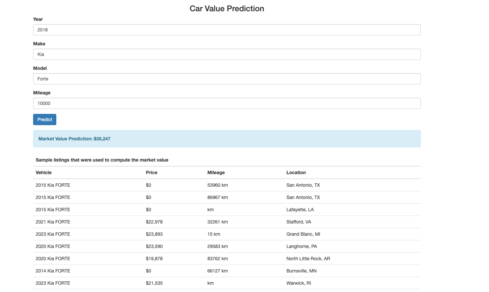
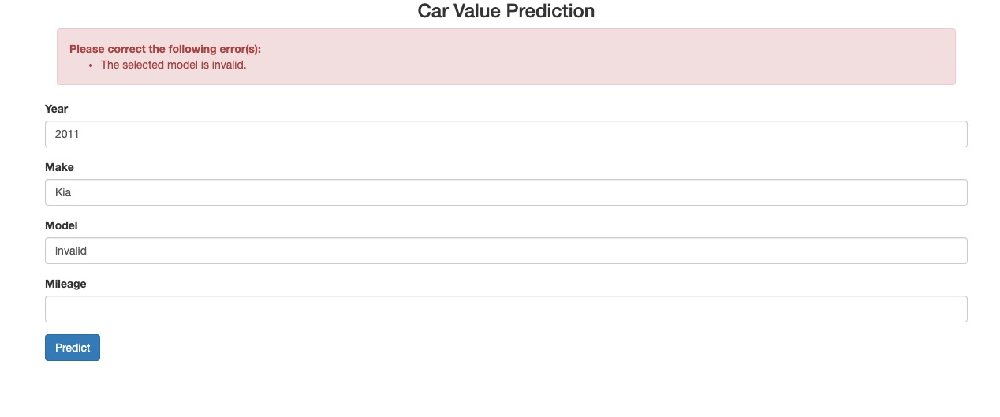
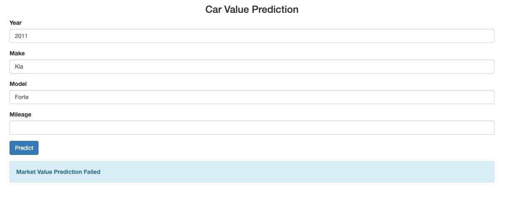
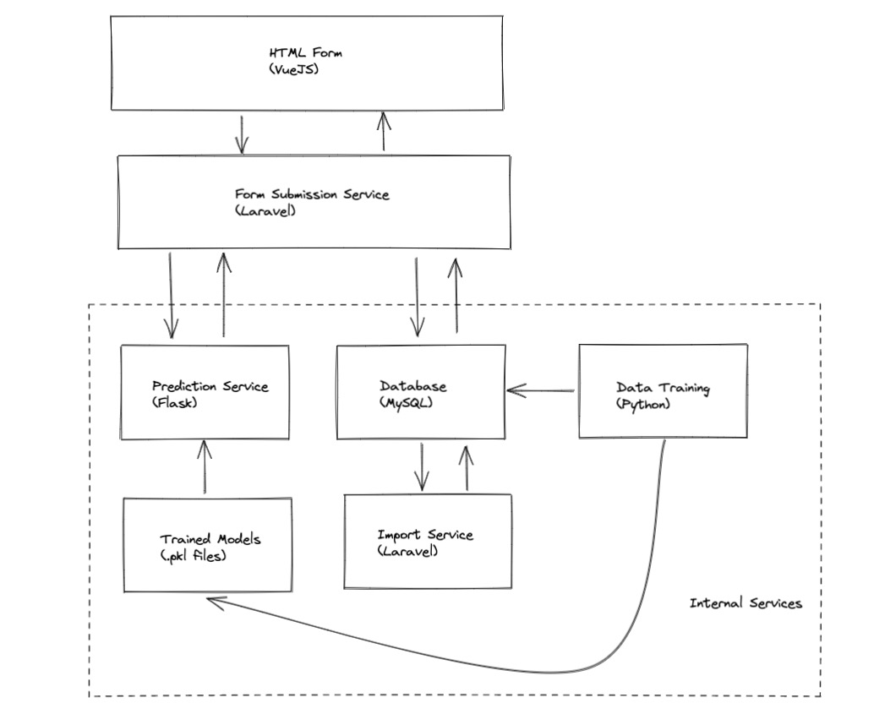
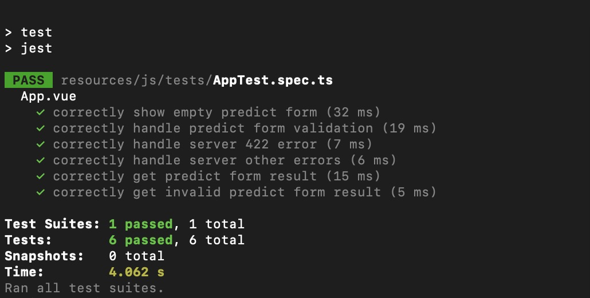
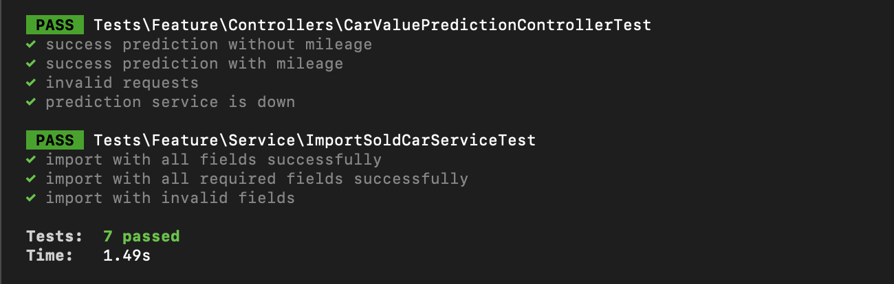
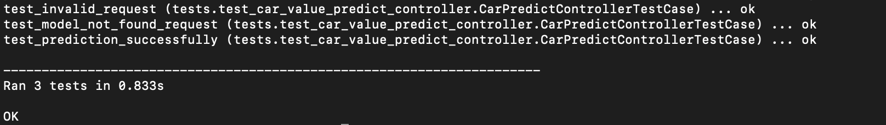

# Car Value Prediction

## Table of Content
* [Overview](#overview)
* [Demo](#demo)
* [Technical Aspect](#technical-aspect)
* [Tests Includes](#tests-includes)
* [Installation](#installation)

## Overview

Create a simple internal search interface for estimating the average market value for a year / make / model 
based on market data file of sold cars

## Demo

[http://test.com] http://test.com

## Technical Aspect

### System Design

#### Notes:
1. "Import Service" imports all market data into database
2. "Data Training Service" trained all data and generate .pkl files
3. "Predict Service" serves car value estimation as an INTERNAL rest api
4. "Form Submission Service" handles form data as a PUBLIC rest api

### Data Flow

#### Sold Cars Data Training
1. "Import Service" parse the .csv file to write all valid data into database
2. "Data Training Service" trained all data and generate .pkl files

#### Car Value Prediction
1. User submits form data (year + make + model + mileage)
2. js validates required fields and send to "Form Submission Service"
3. "Form Submission Service" receives data and validate make + model exist in database and send to "Prediction Service"
4. "Prediction Service" receives data and load .pkl file to estimate car price and send back
5. "Form Submission Service" receives prediction and send back to user

### Database Schema

Migration file is: [database migration](frontend/database/migrations/2022_11_12_072021_init_tables.php)

- car_makes (id, name, ...) stores car make data
- car_models (id, car_make_id, name, ...) stores car model data 
- deals (id, name, address, city, state, zip...) stores dealer info 
- car_solds (id, car_model_id, dealer_id, year, listing_price_in_cents, listing_mileage, ...) stores sold cars info

### Algorithm Used

- Trained Machine Learning models using Random Forest Regression: [car_value_predict,py](backend/scripts/car_value_predict.py)
  1. load sold car from database based on "make"
  2. clean data to remove outlier prices
  3. train data based on age of car + mileage
  4. each car make will have a separate trained model
  
- Optimizations
  1. find standard car info: for ex. model, make, etc.
  2. clean current data and classifier them into standard categories 
  3. train data based on more metrics: for ex. sold location, fuel type, color, etc. 
  4. generate trained models with more metrics: for ex make+model, make+model+location, etc.

Notes:
- Jupter notebook to demonstrate the algorithm is: [car_value_predict_note](backend/notebooks/car_value_predict_note.ipynb)
- Jupter Sample result is [car_value_predict_note_result](docs/car_value_predict_note.pdf)

### Technologies Used

This project is divided into:
1. VueJs + Bootstrap to handle webpage
2. Php with Laravel to handle data import script and rest api of form submission
3. Python with Flask to handle predict rest api
4. Python with sklearn to train market sold cars data
5. Python with Jupter notebook to demonstrate the algorithm

### Technical Skills covers

#### JS
- vue framework
- jest unit test

#### Php
- laravel framework
- database migration
- seeds
- layer pattern
- form request validation
- console command
- service provider
- unit tests
- mix

#### Python
- flask framework
- request validation
- exception handling
- machine learning
- unit test

## Tests Includes

### Js (Jest)

### Php unittest

### Python unittest

## Installation

1. Laravel + Vue installation ([README.md](frontend/README.md))
2. Flask installation ([README.md](backend/README.md))
